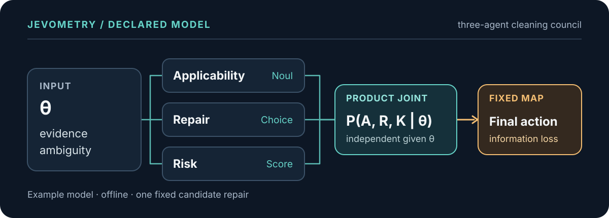

# Jevometry

**See how an agent system's probability distributions change with its inputs.**

[](https://github.com/Kunyanli230/Jevometry/actions/workflows/ci.yml)

`v0.2.0 alpha` · Python 3.11–3.13 · MIT · offline core

Jevometry captures explicit Jev decision probabilities and measures local
sensitivity, Fisher information, and the information retained by a final
decision. System results use a joint model you declare; statistical inference
requires a separate observation model. The toolkit analyzes systems without
orchestrating their agents or changing their decisions.

<p align="center">
  
</p>

The diagram shows the fully offline
[Three-Agent Data Cleaning Council](examples/three_agent_cleaning/README.md).
Its declared independence assumption is part of the model, not a property
inferred from separate agent outputs.

## Run the example

The council examines one candidate repair: `monthly_income_usd` changes from
`" 1,200 "` to `1200`. Start with [uv](https://docs.astral.sh/uv/) installed:

```bash
git clone https://github.com/Kunyanli230/Jevometry.git
cd Jevometry
uv sync --locked
uv run python examples/three_agent_cleaning/run.py
```

At `evidence=0.7` and `ambiguity=0.3`, the included analytic model yields:

```text
applicability_agent: Fisher trace 3.074, rank 1
repair_agent:        Fisher trace 1.773, rank 2
risk_agent:          Fisher trace 1.995, rank 2
System Fisher trace: 6.842
Information loss:    3.034
Final action: auto_fix 0.236 · human_review 0.294 · reject 0.470
```

Open `examples/three_agent_cleaning/output/report.html` after running the
command. The report and captures are generated locally; they are not tracked
in Git. These figures describe the declared probability family at one point.
They are not measured cleaning accuracy or empirical calibration.

## What Jevometry computes

- **Compare distributions.** Entropy, KL, Jensen–Shannon, Hellinger and
  Fisher–Rao measures require aligned probability supports.
- **Find sensitive inputs.** Derivatives, node Fisher matrices, rank and
  stability diagnostics require parameterized distributions and analytic
  derivatives or finite-difference captures.
- **Measure system information.** Joint Fisher information and loss under a
  fixed final-action map require a declared joint, product model or
  conditional tree.
- **Assess inference.** A Cramér–Rao bound and optional synthetic MLE check
  require a likelihood, estimand and complete sampling contract.

Jevometry records assumptions, provenance and status with each result. It
refuses quantities that the available data and declarations cannot support;
separate marginal distributions do not determine a system joint.

Read the [statistical contracts](docs/statistical_contracts.md) and
[mathematics](docs/mathematics.md) before interpreting Fisher information or
CRLBs. A reported Jev probability is not an observed categorical draw.

## Explore the repository

- [Three-Agent Data Cleaning Council](examples/three_agent_cleaning/README.md) —
  three agent distributions, a declared joint and a fixed coordinator.
- [Analytic geometry laboratory](examples/analytic_geometry/run.py) — logistic
  and softmax families, rank deficiency and aggregation loss.
- [System information and inference](examples/system_information/run.py) —
  independent draws, deterministic copies, conditional trees and synthetic MLE.
- [Ticket-system sensitivity](examples/jev_ticket_sensitivity/run.py) — a
  synthetic policy and an optional live TypeSafe capture.

The [quickstart](docs/quickstart.md) covers the Python API and CLI. See
[adapters](docs/adapters.md) to connect another system and
[experiment design](docs/experiment_design.md) to choose parameters and
finite-difference steps.

## Capture live Jev decisions

Live capture is optional. In Bash or WSL, install the TypeSafe SDK extra and
supply a concrete model ID available to your account:

```bash
uv sync --locked --extra live
read -rsp 'TypeSafe API key: ' TYPESAFE_API_KEY
echo
export TYPESAFE_API_KEY
uv run --extra live python examples/jev_ticket_sensitivity/run.py --live --model jev-1.13.0
unset TYPESAFE_API_KEY
```

`jev-1.13.0` was used for the initial smoke test; it is not a claim about the
latest available model. This example makes 27 batch evaluations before
retries and writes its report under
`examples/jev_ticket_sensitivity/output/live/`. Provider calls may incur
charges. Review captured inputs and outputs before sharing artifacts.

The initial live capture returned 81 successful node records, but all three
nodes failed the derivative step-stability check. It established that capture
and reporting work; its Fisher estimates should not be used as reliable
measurements. The example declares no joint observation model, so it produces
neither system Fisher information nor a CRLB.

## Changes in v0.2

Request plans now count every repeated stencil evaluation and respect the
actual boundary stencil. Unstable derivatives propagate their status to
dependent Fisher quantities; capability summaries distinguish unavailable
captures from unstable measurements. Replay requires the exact recorded repeat
and checks declared source identity without substituting another capture.

Audit a saved run offline with:

```bash
uv run jevometry verify examples/three_agent_cleaning/output --json
```

The audit checks managed artifacts and retained analysis revisions. Reports
save a new revision and refresh checksums. See the
[v0.2 scope and migration notes](docs/v0.2.md),
[numerical limits](docs/numerical_limits.md) and
[data handling](docs/data_handling.md).

## Develop

```bash
uv sync --locked --extra live
uv run --extra live ruff check src tests examples
uv run --extra live mypy
uv run --extra live pytest --cov=jevometry --cov-branch
uv build
```

The live adapter tests use mocked transport and need no API key. CI checks
Python 3.11, 3.12 and 3.13. See [Contributing](CONTRIBUTING.md),
[Security](SECURITY.md) and the [release process](docs/release.md).

Jevometry is an independent project, not an official TypeSafe product.
Licensed under [MIT](LICENSE).
